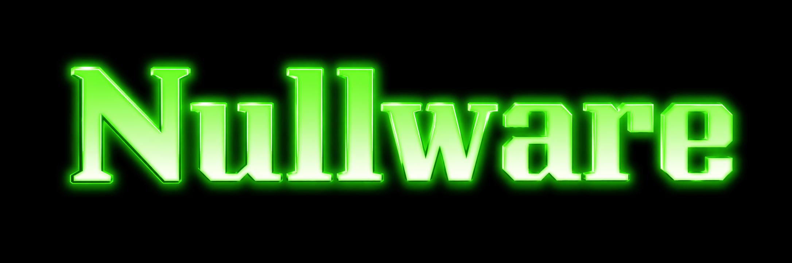

<div align="center">



# 🚀 Nullware

Modernized and enhanced version of the original Nullware project.

**Credit:**  
Original Project by [rei-2](https://github.com/rei-2/Nullware)

[](https://github.com/NullwareN/Nullware/stargazers)
[](https://github.com/NullwareN/Nullware/network)
[](https://github.com/NullwareN/Nullware/commits)
[]()

💬 **Community Discord**  
https://discord.gg/VfVSZTHgsq

</div>

---

# 🛠️ Build Requirements

| Requirement | Version |
|-------------|--------|
| IDE | Visual Studio 2022 |
| Toolset | v143 |
| Language | C++20 |
| Platform | x64 |

---

# 📥 Building

### 1. Clone the repository

```bash
git clone https://github.com/NullwareN/Nullware.git
```

### 2. Open the solution

```
Nullware.sln
```

### 3. Build using Visual Studio

Configuration:

```
Release | x64
```

---

# ❤️ Credits

Developed and maintained for the community.

Original project by
**rei-2**

---

<div align="center">

## ⭐ Support the Project

If you like the project, consider **starring the repository**.

A ⭐ helps the project grow and reach more developers.

</div>
